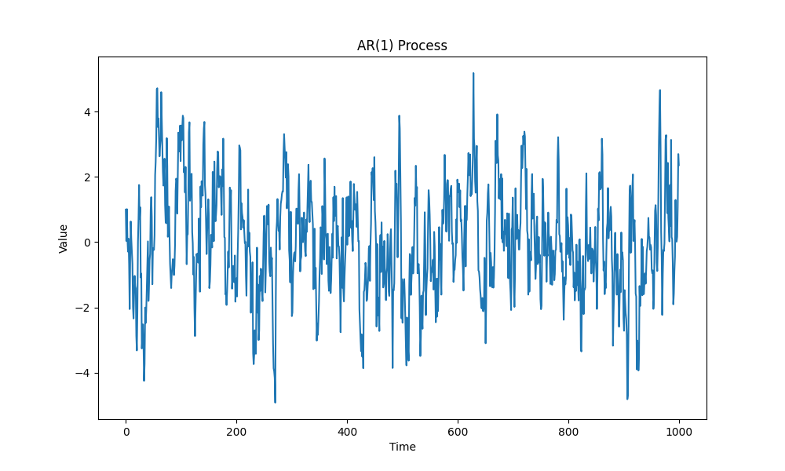
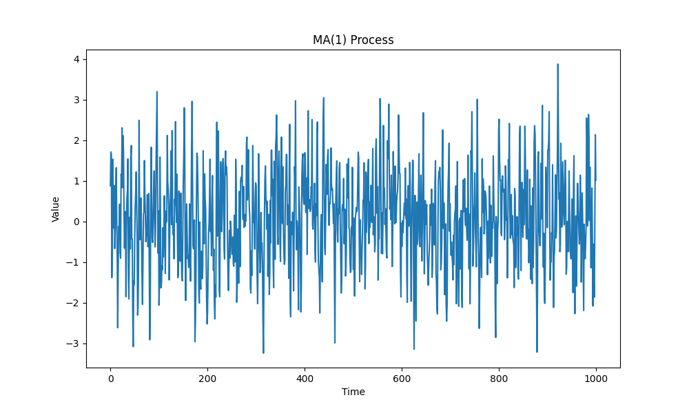

## AR and MA Models 

### Autoregressive (AR) Models

An autoregressive model is a type of time series model where the current value of the series depends on its own previous values. The order of an AR model, denoted as AR(p), indicates the number of lagged values used in the model.

The general form of an AR(p) model is:

X(t) = c + φ₁X(t-1) + φ₂X(t-2) + ... + φₚX(t-p) + ε(t)

where:
- X(t) is the current value of the time series
- c is a constant
- φ₁, φ₂, ..., φₚ are the coefficients of the lagged values
- ε(t) is white noise


Stationarity:
When |ϕ₁| < 1, the AR(1) process is stationary. Stationarity is a crucial property in time series analysis because it implies that the statistical properties of the process, such as its mean, variance, and autocorrelation, do not change over time. In a stationary AR(1) process, the effect of a shock (ϵₜ) will gradually diminish over time, and the series will revert to its long-term mean.

Unit Root and Random Walk:
When ϕ₁ = 1, the AR(1) process has a unit root and becomes a random walk. In this case, the current value of the series is equal to its previous value plus a random shock. The presence of a unit root makes the series non-stationary, meaning that its statistical properties change over time. Shocks to a random walk process have a permanent effect, and the series does not revert to a long-term mean.

Explosive Process:
When |ϕ₁| > 1, the AR(1) process is explosive. In this scenario, the effect of a shock grows exponentially over time, causing the series to diverge from its mean. Explosive processes are rarely observed in real-world economic time series because they imply an unsustainable growth or decline.

Estimation and Inference:
The coefficient ϕ₁ is typically estimated using methods such as Ordinary Least Squares (OLS) or Maximum Likelihood Estimation (MLE). Once the coefficient is estimated, it is essential to assess its statistical significance. This is usually done by conducting hypothesis tests or constructing confidence intervals. If the coefficient is found to be statistically significant, it provides evidence of the presence of autocorrelation in the series.

Python script for generating an AR(1) model:

[ar1_model.py](./ar1_model.py)

```python
import numpy as np
import matplotlib.pyplot as plt

# Set parameters
n = 1000  # Number of observations
phi = 0.8  # AR(1) coefficient
mean = 0
std_dev = 1

# Generate AR(1) process
x = np.zeros(n)
x[0] = np.random.normal(mean, std_dev)

for i in range(1, n):
    x[i] = phi * x[i-1] + np.random.normal(mean, std_dev)

# Plot the AR(1) process
plt.figure(figsize=(10, 6))
plt.plot(x)
plt.title('AR(1) Process')
plt.xlabel('Time')
plt.ylabel('Value')
plt.show()
```




### Moving Average (MA) Models

A moving average model is another type of time series model where the current value of the series depends on the past errors or residuals. The order of an MA model, denoted as MA(q), indicates the number of lagged errors used in the model.

The general form of an MA(q) model is:

X(t) = μ + ε(t) + θ₁ε(t-1) + θ₂ε(t-2) + ... + θₚε(t-q)

where:
- X(t) is the current value of the time series
- μ is the mean of the series
- ε(t), ε(t-1), ..., ε(t-q) are the white noise errors
- θ₁, θ₂, ..., θₚ are the coefficients of the lagged errors

Python script for generating an MA(1) model:

[ma1_model.py](./ma1_model.py)

```python
import numpy as np
import matplotlib.pyplot as plt

# Set parameters
n = 1000  # Number of observations
theta = 0.6  # MA(1) coefficient
mean = 0
std_dev = 1

# Generate white noise
eps = np.random.normal(mean, std_dev, n)

# Generate MA(1) process
x = np.zeros(n)
x[0] = eps[0]

for i in range(1, n):
    x[i] = eps[i] + theta * eps[i-1]

# Plot the MA(1) process
plt.figure(figsize=(10, 6))
plt.plot(x)
plt.title('MA(1) Process')
plt.xlabel('Time')
plt.ylabel('Value')
plt.show()
```



