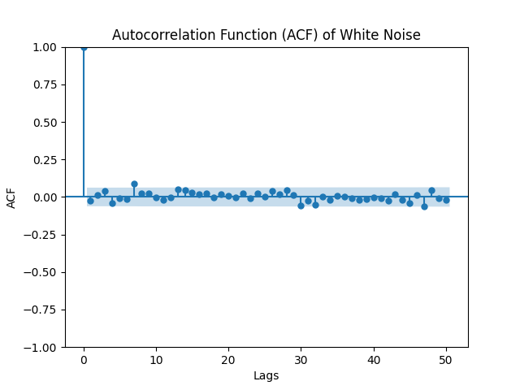
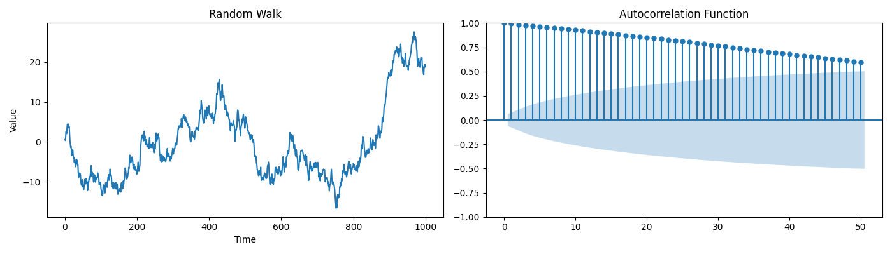

# Autocorrelation and Crosscorrelation Notes

## Introduction

Autocorrelation and crosscorrelation are essential concepts in time series analysis. Autocorrelation measures the correlation of a signal with a delayed copy of itself, while crosscorrelation measures the correlation between two different signals. These techniques help in identifying patterns, trends, and relationships within and between time series data.

## White Noise Autocorrelation

White noise is a random signal with a constant power spectral density. In the context of autocorrelation, white noise has a theoretical autocorrelation function (ACF) where all lags are zero except for lag 0 (which is 1 due to normalization). However, due to random variations, you will see small non-zero values at different lags in the plot, which should not be significant and should not show any pattern as illustrated below:

Python script for white noise autocorrelation here: [gaussian_white.py](./gaussian_white.py)

Python script for plotting the random walk and its autocorrelation function (ACF) here: [Random_walk.py](./Random_walk.py)

## Crosscorrelation

Crosscorrelation is a measure of similarity between two different time series as a function of the displacement of one relative to the other. It is used to find the relationship between two signals and determine if they are related or if one signal is influencing the other. Crosscorrelation can help in identifying time delays, phase differences, and common periodicities between two time series.

The crosscorrelation function (CCF) is computed by sliding one signal over the other and calculating the dot product at each shift. The resulting CCF will have peaks at lags where the signals are most similar and valleys where they are most dissimilar. The magnitude of the peaks indicates the strength of the correlation, while the lag at which the peak occurs represents the time delay between the signals.

Crosscorrelation is widely used in various fields, such as signal processing, pattern recognition, and econometrics, to analyze the relationship between different time series and extract meaningful insights from the data.

A random walk is a time series model where each value is the sum of the previous value and a random error term. Mathematically, a random walk \( Y_t \) can be defined as:

\[ Y_t = Y_{t-1} + \epsilon_t \]

where \( \epsilon_t \) is a white noise error term with a mean of zero and constant variance.

A random walk is not stationary because it violates two key properties of stationarity:

1. **Constant Mean:** The mean of a stationary process should not depend on time. However, in a random walk, since each term is added to the previous term, the mean grows with time as the random walk progresses, assuming the error terms have a non-zero mean.

2. **Constant Variance:** The variance of a stationary process should not depend on time. In a random walk, the variance increases over time because the sum of random variables (the error terms) leads to an increase in the overall variance of the process. The variance of the sum of independent random variables is the sum of their variances, which grows with the number of terms.

3. **Covariance Independent of Time:** In a stationary process, the covariance between two points should only depend on the distance between the points, not the actual time at which they occur. A random walk does not satisfy this property because the covariance between observations increases as we move further apart in time.

The difference operator can help make a random walk stationary. Differencing a time series means subtracting the previous observation from the current observation. If we apply the first difference to the random walk, we get:

\[ \Delta Y_t = Y_t - Y_{t-1} = \epsilon_t \]

Now, the differenced series \( \Delta Y_t \) is stationary because it is equal to \( \epsilon_t \), which is a white noise process with a constant mean of zero and constant variance. The differencing operation has removed the time-dependent structure of the series (the growing mean and variance), leaving a stationary white noise process.

By differencing, we've essentially transformed the non-stationary process into a stationary one by eliminating the trend and stabilizing the variance. This is why differencing is a common technique in time series analysis to achieve stationarity, which is an assumption required by many statistical methods.

Gaussian white noise looks choppy and a random walk looks smooth. 
